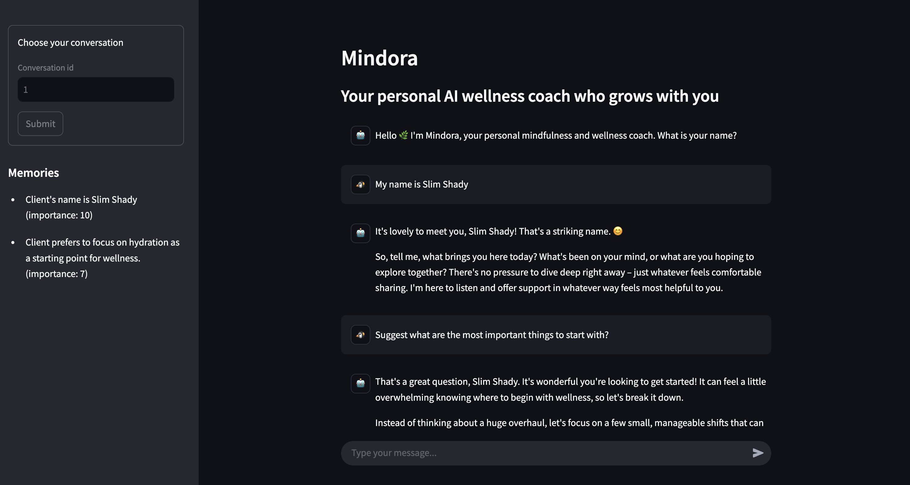

# Mindora

Local chatbot with conversation history and memory capabilities with persistence using SQLite



Features:

- Local chatbot that acts as a wellness coach
- Conversation history stored in database (SQLite)
- Memory management: remembers user preferences and past interactions
- Uses Ollama for LLM inference

## Workflow components

- [`Load memory`](mindora/chatbot.py): loads stored memories for the current user
- [`Generate response`](mindora/chatbot.py): generates a response to the user query using the conversation history and memories
- [`Save new memory`](mindora/chatbot.py): decide whether to save the new memory based on the user query

## Install

Make sure you have [`uv` installed](https://docs.astral.sh/uv/getting-started/installation/).

Clone the repository:

```bash
git clone git@github.com:mlexpertio/mindora.git .
cd mindora
```

Install Python:

```bash
uv python install 3.12.8
```

Create and activate a virtual environment:

```bash
uv venv
source .venv/bin/activate
```

Install dependencies:

```bash
uv sync
```

Install package in editable mode:

```bash
uv pip install -e .
```

Install pre-commit hooks:

```bash
uv run pre-commit install
```

### Run Ollama

Mindora uses Ollama for LLM inference. Watch this video to see how to install Ollama: https://www.youtube.com/watch?v=lmFCVCqOlz8

The chat model we'll use is `gemma3:12b`:

```bash
ollama pull gemma3:12b
```

The model for tool calling we'll use is Qwen 2.5 7B:

```bash
ollama pull qwen2.5
```

Feel free to experiment with other models.

### (Optional) Groq API

You can also use models from Groq (get your API key from https://console.groq.com/keys).

Rename the `.env.example` file to `.env` and add your API key inside:

```bash
mv .env.example .env
```

Look into the [`config.py`](mindora/config.py) file to set your preferred model.


## Run the Streamlit app

Run the app:

```bash
streamlit run app.py
```